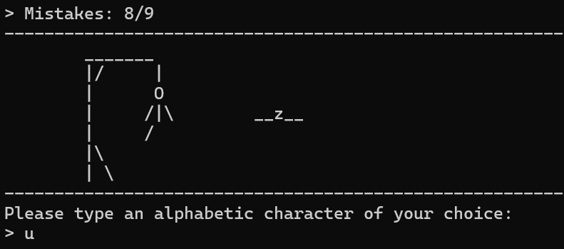

# Welcome to Terminal Hangman Game (written in C)
This is a simple Hangman game that runs in the terminal. While there are some minor changes/improvements planned, it should work without any bugs.
I hope you enjoy it:)



## Linux
Required files for playing:
* `hangman`
* `dictionary`
* `Makefile` (optional)
Run the game with `./hangman` or (optional) with `make run`

Required files for compiling:
* `hangman.c`
* `Makefile`
To build and run the game, type the following commands in your terminal (gcc required):
```
make
make run
```

## Windows
Required files for playing:
* `dictionary`
* `hangman.exe`

To run the game on Windows, simply launch `hangman.exe` file.

Required files for compiling:
* `hangman.c`

## Future improvements or known issues:
- Add difficulty selector: Implement different difficulty levels by limiting the number of incorrect guesses allowed.
- Return to main menu: Allow player to return to the main menu after a game instead of closing the program.
- Handle the dictionary better: The current dictionary is limited to 100 lines and fixed word size, which can cause issues if edited. (dynamic memory allocation)
